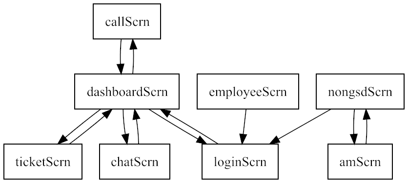
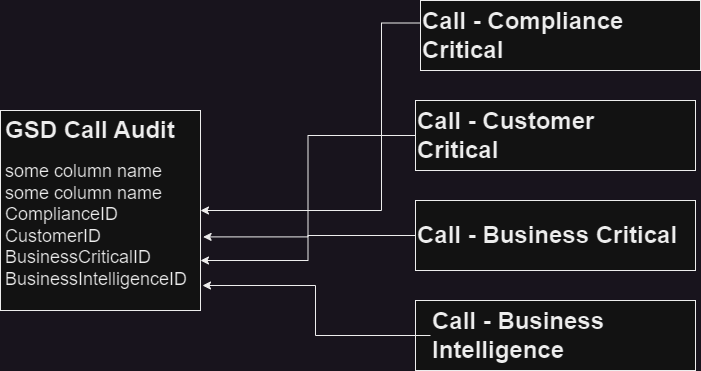
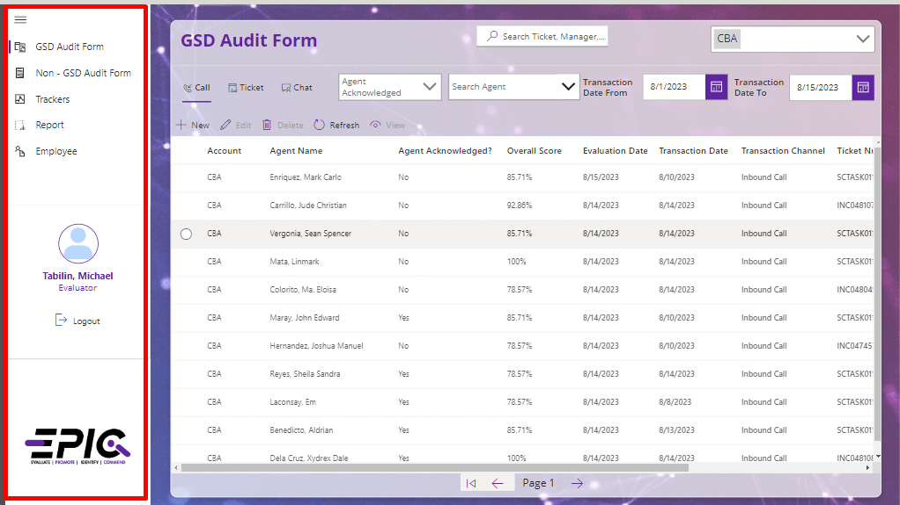
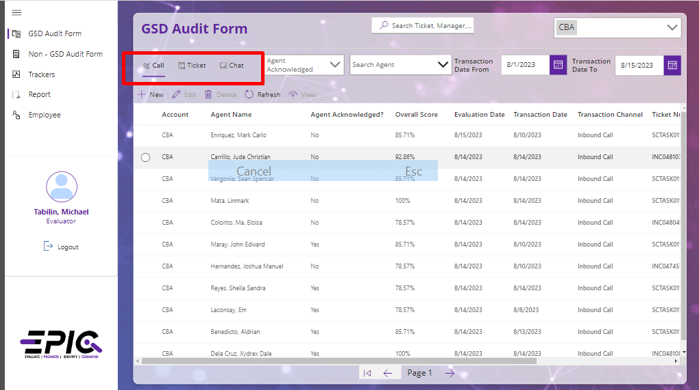
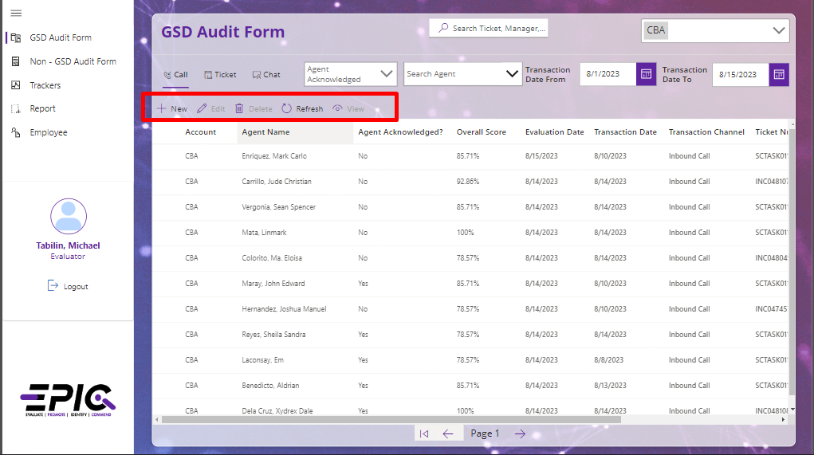
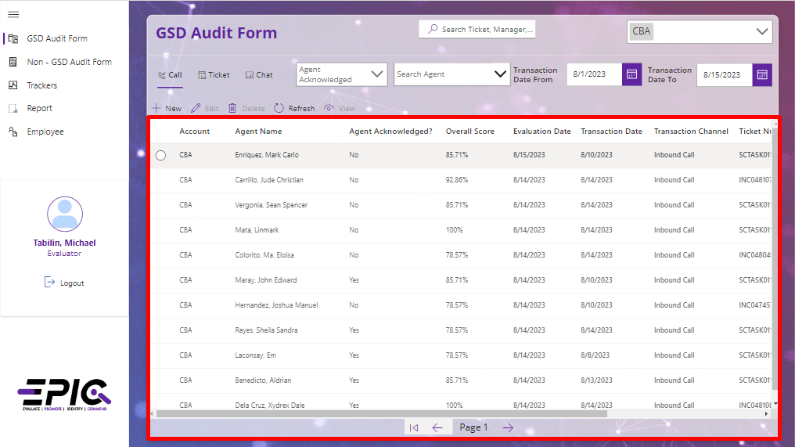
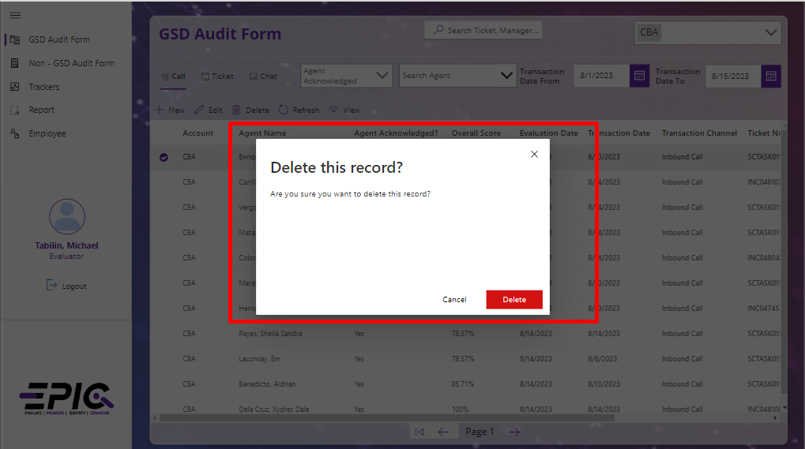

# EPIC Tool Dev Guide

This guide is about how the tool is created based on the required specifications for this app.

Link: [EPIC Tool](https://apps.powerapps.com/play/e/c7d45143-8350-e986-bf1c-8ee552a8d40f/a/999b907d-6a35-4cb6-80c1-08c581be1141?tenantId=93f33571-550f-43cf-b09f-cd331338d086&sourcetime=2023-08-15%2006%3A50%3A26Z)

## Tech Stacks

- Power App
- Power Automate
- SharePoint
- Creator Kit (A kit that contains component library here's the [link](https://learn.microsoft.com/en-us/power-platform/guidance/creator-kit/overview) for more details )

## Screen Navigation

## Data Flow and Lists (Sharepoint)

[EPIC Development SP Site](https://dxcportal.sharepoint.com/sites/EPICDevelopment)

Data is efficiently managed through utilization of a Sharepoint list, ensuring organized and streamlined handling.

There are already 24 SharePoint lists connected to the app. Some of the lists have relationships with other lists to manage and organize the data, as listed below:

- Account Master List
- GSD Call Audit
  - Call-Compliance Critical
  - Call-Customer Critical
  - Call-Business Critical
  - Call-Business Intelligence
     
- GSD Ticket Audit
  - Ticket-Compliance Critical
  - Ticket-Customer Critical
  - Ticket-Business Critical
  - Ticket-Business Intelligence
     
- GSD Chat Audit
  - Chat-Compliance Critical
  - Chat-Customer Critical
  - Chat-Business Critical
  - Chat-Business Intelligence
     
- Non-GSD AM Audit
  - AM-Requirements
  - AM-Customer PO
  - AM-Vendor Quote
     
- Non-GSD IM Audit
  - IM-Requirements
  - IM-Customer PO
  - IM-Vendor Quote

Please refer to the sample illustration below to understand the relationship of the column reference to the other SharePoint list, based on the ID

## UI used from Creator Kit:

`Please review the highlighted sections in the screenshot for each control and click the docs link for more information`  

**Expand Menu Control**

It is used to navigate through every screen of the entire app. See [docs](https://learn.microsoft.com/en-us/power-platform/guidance/creator-kit/expandmenu).

**Pivot Control**

The Pivot control and related tabs pattern are used for navigating frequently accessed, distinct content categories. See [docs](https://learn.microsoft.com/en-us/power-platform/guidance/creator-kit/pivot).

**Command Bar**

CommandBar is a surface that houses commands that operate on the content of the window, panel, or parent region it resides above. See [docs](https://learn.microsoft.com/en-us/power-platform/guidance/creator-kit/commandbar).

**Details List**

A details list (DetailsList) is a robust way to display an information-rich collection of items, and allow people to sort, group, and filter the content. Use a details list when information density is critical. See [docs](https://learn.microsoft.com/en-us/power-platform/guidance/creator-kit/detailslist).

**Dialog**

A dialog box (Dialog) is a temporary pop-up that takes focus from the page or app and requires people to interact with it. It’s primarily used for confirming actions, such as deleting a file, or asking people to make a choice. See [docs](https://learn.microsoft.com/en-us/power-platform/guidance/creator-kit/dialog).
